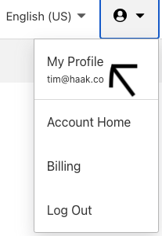
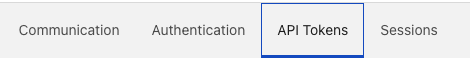
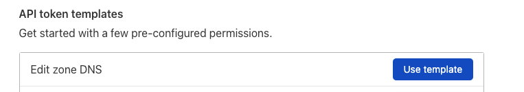
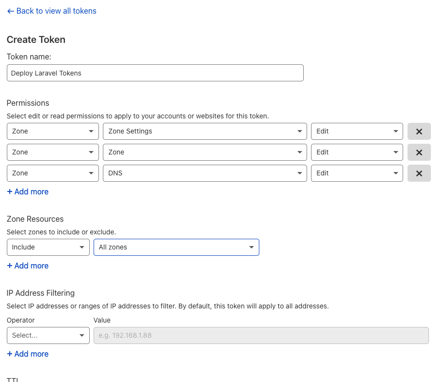

# Getting your Cloudflare API keys

To simplify things, we aren't going to entirely create the DNS zone as you should have one from the previous steps.

Though we are going to generate a token that can, so we have it for future stages.

You may want to lock down the token more than we are doing in the example.

Log into your Cloudflare account.

On the top right, click on the user icon and then click on ```My Profile```.



On the next page, select the 'Api Tokens' menu option.



Select the ```Edit zone DNS``` ```Use Template``` button.



Now select the ```Create Token``` button.


Give your token a name. (Please do this will help quite a bit once you have more than one token)

For permissions add the following.

* Zone->Zone Settings->Edit
* Zone->Zone->Edit
* Zone->DNS->Edit

For zone restrictions, I've set it to all zones though you may want to lock this down to your specific account or zone.

I've left IP Address filtering blank, but it's also a good idea to do this if you can.

Once done, click ```Continue to Summary```




Now copy the token from the next page.

Save this somewhere safe as you won't be able to get it again.

I recommend using shared team password management. I'm currently using [https://1password.com/](https://1password.com/),
some friends are using [https://lastpass.com/](https://lastpass.com/), but any will work.

I also recommend creating a bash function to set it as an environmental variable.

Using environmental variables makes it simpler to switch between accounts. It also means you less likely to save any
sensitive information in your code.

While we are at it will also add one for TF_VAR_cf_api_key for Terraform.

Here is an example of how to do this. Just add the following to your .bashrc or .zshrc.

```shell
setCFLvDepProfile() {  
  export CLOUDFLARE_API_TOKEN="MY_TOKEN"
  export TF_VAR_cf_api_key="${CLOUDFLARE_API_TOKEN}"
}
```
